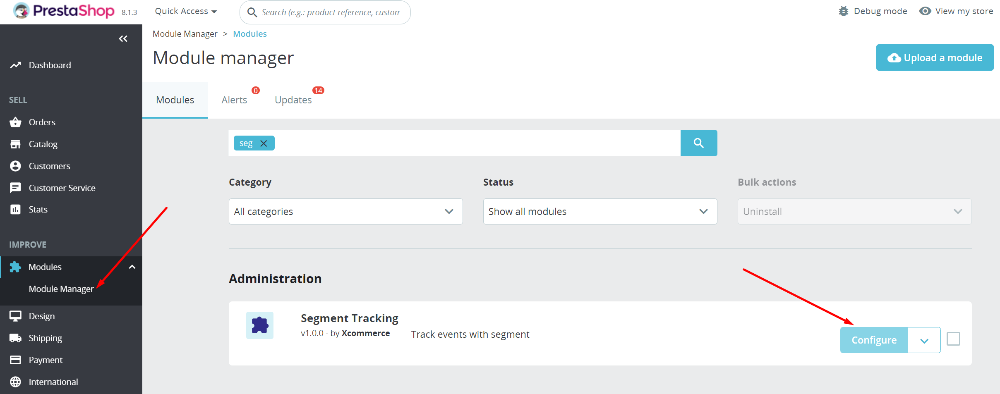
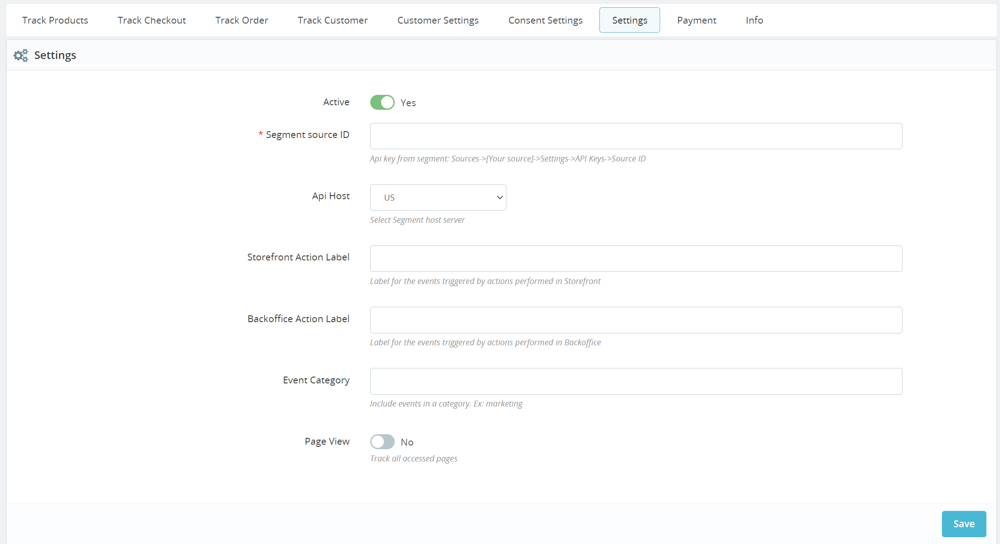
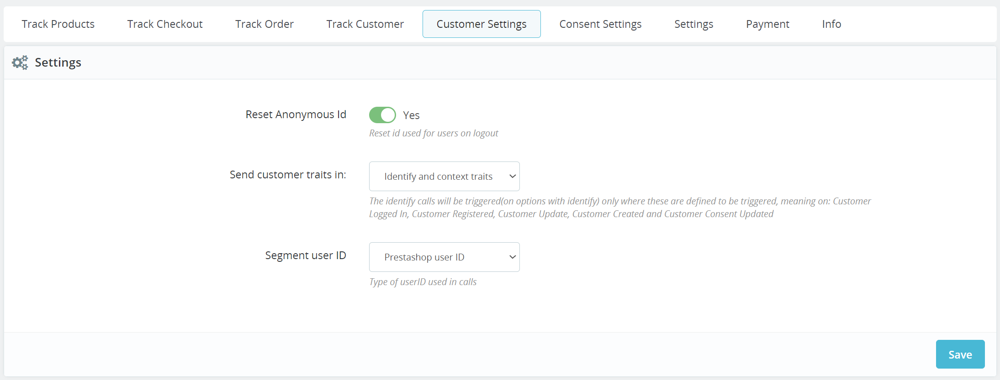

> (delete after reading) Include a 1-2 sentence introduction to your company and the value it provides to customers - updating the name and hyperlink. Please leave the utm string unchanged.

[<Segment Tracking>](https://yourintegration.com/?utm_source=segmentio&utm_medium=docs&utm_campaign=partners){:target="_blank”} provides self-serve predictive analytics for growth marketers, leveraging machine learning to automate audience insights and recommendations.

This is an [Event Cloud Source](/docs/sources/#event-cloud-sources) which can not only export data into your Segment warehouse, but can also federate the exported data into your other enabled Segment Destinations.

> (delete after reading) Update your company name and support email address.

This source is maintained by Prestashop - Segment Tracking by Xcommerce. For any issues with the source, [contact their Support team](mailto:support@<integration_name>.com).

## Installation

1. Get the Xcommerce Segment Integration from Shopware Market. 
  After the purchase, you will get a .zip file
2. Go to Prestashop Admin Panel -> Improve -> Module Manager
3. Click "Upload a module" and select the .zip file for the upload

## Configuration

1. To configure the module go to Prestashop Admin Panel -> Improve -> Module Manager
2. Browse for the Segment Tracking module and select Configure option for the module

    

   > [!NOTE]
   > On the configuration page you will see a number of Tabs corresponding to various settings. Start with the las tab (Settings) [!NOTE]

3. Settings tab:

    
   - Active - Select if the Module is active and sends data to Segment
   - Client API key - API key for the designated Segment Source
   - Client API Host - Only needed if the host is not in the US ***More details may be needed, but could not find any in the Segment documentation (https://segment.com/docs/connections/sources/catalog/libraries/website/javascript/custom-proxy/ https://segment.com/docs/connections/sources/catalog/libraries/server/http-api/)***
   - Client Sent From - Designate a label you want to be included in the events sent for Client Side
   - Server to Server API key - You can use the API key of the Source used for Client Side, or you can create a separate Segment source and use the API key for the second source
   - Server API host - Only needed if the host is not in the US ***More details may be needed, but could not find any in the Segment documentation (https://segment.com/docs/connections/sources/catalog/libraries/website/javascript/custom-proxy/ https://segment.com/docs/connections/sources/catalog/libraries/server/http-api/)***
   - Server Sent From - Designate a label you want to be included in the events sent for Server Side
   - Event Category - Designate the default event category name. This will be visible in all Events (Client side and Server side)
   - Track Page View - You can select if you want to track all the viewed pages. This will send an event o every page load.
         
   > [!IMPORANT] Make sure to click Save after you are satisfied with the configurations.
4. CustomerSettings tab:

    
    Here you will find two settings: "Customer traits included in:" and "Customer Id value"

   - Customer traits included in:
     - Identity - in the trait location ***(needs more details)***
     - Track context traits: in the context.traits location ***(needs more details)***
     - Track context properties: in the properties location ***(needs more details)***
     
   - Customer ID value
     - Default user id - use the Prestashop user ID as the Customer ID value
     - Custom user id - you can specify a certain field from the Database ***(Presta User ID should be mentioned in the separate table if a different table than ps_customer is used)***
     - Email dash - use the emai dash of the customer as the Customer ID value
     - Not use user id - use an anonymous ID as the Customer ID value
   - Make sure to click Save after you are satisfied with the configurations.
     
5. The rest of the tabs can be used to enable or disable the Events tracked by Segment Tracking. There are 4 tabs, one for each Event Category: Track Products, Track Checkout, Track Order and Track Customer. Use these tabs to select which event you want Segment Tracking to track

## Getting started (***Maybe moved above instalation***)

> (delete after reading) Include clear, succinct steps including hyperlinks to where customers can locate the place in your app to enter their Segment writekey.

1. From your workspace's [Sources catalog page](https://app.segment.com/goto-my-workspace/sources/catalog){:target="_blank”} click ***Add Source***.
2. Search for "Prestashop - Segment Tracking by Xcommerce" in the Sources Catalog, select Prestashop - Segment Tracking by Xcommerce, and click ***Add Source***.
3. On the next screen, give the Source a name configure any other settings.
   - The name is used as a label in the Segment app, and Segment creates a related schema name in your warehouse. The name can be anything, but we recommend using something that reflects the source itself and distinguishes amongst your environments (eg. SourceName_Prod, SourceName_Staging, SourceName_Dev).
4. Click ***Add Source*** to save your settings.
5. Copy the Write key from the Segment UI.
6. Log in to your Prestashop Admin Panel, go to "Prestashop - Segment Tracking by Xcommerce" Module Settings, and paste the API Key in the Settings tab (as described in the Configuration section) ***To check phrasing***

## Stream

> (delete after reading) Clarify the type of Segment events your integration will send. 

Prestashop - Segment Tracking by Xcommerce uses our stream Source component to send Segment event data. It uses a server-side (select from `track`, `identify`, `page`, `group`) ***We need to clarify and mention which methods are used for Server Side*** method(s) to send data to Segment. These events are then available in any destination that accepts server-side events, and available in a schema in your data warehouse, so you can query using SQL.

> (delete after reading) Clarify how your integration includes user identifiers in your event payloads, the example below is from Klaviyo:

The default behavior is for Klaviyo (***Klaviyo is a data analytics driven marketing platform https://www.klaviyo.com/about It seems that this is an informative note of how Klaviyo is expecting data***) to pass the userId associated with the email recipient as the userId. There are cases in which Klaviyo does not have an associated userId, in which case the email address will be passed in as the anonymousId.

> (delete after reading) For each of the below sections, populate the event and properties that a customer would expect to receive in their downstream tools from your Event Source.

## Events

The table below lists events that Prestashop - Segment Tracking by Xcommerce sends to Segment. These events appear as tables in your warehouse, and as regular events in other Destinations. Prestashop - Segment Tracking by Xcommerce includes the `userId` if available.

### Device-mode events (client side)

Device-mode handles events triggered directly by the user. This kind of information is usually not stored in the database, things like page views, button clicks or mouse movements.

| Event Name                     | Description                                                 |
|--------------------------------|-------------------------------------------------------------|
| Product List Viewed            | User has viewed a product collection                        |
| Product Clicked                | User has clicked on a product from the collection           | 
| Product Viewed                 | User has viewed the product detail page                     | 
| Product Shared                 | User has shared a product                                   | 
| Product Image Clicked          | User has clicked a product image                            | 
| Products Searched              | User has searched for products                              | 
| Registration Viewed            | User has viewed the registration form                       | 
| Thankyou Page Viewed           | User had viewed the thank you page                          | 
| Product Added                  | User added a product to their shopping cart                 | 
| Product Removed                | User removed a product from their shopping cart             | 
| Cart Viewed                    | User viewed their shopping cart                             | 
| Checkout Started               | User initiated the order process (a transaction is created) | 
| Checkout Step Viewed           | User viewed a checkout step                                 |
| Checkout Step Completed        | User completed a checkout step                              |
| Payment Info Entered           | User added payment information                              |
| Order Completed                | User completed the order                                    |
| Order Canceled                 | User canceled the order                                     |
| Order Refunded                 | User refunded for the order                                 |
| Coupon Applied                 | Coupon was applied on a user’s shopping cart or order       |
| Product Added to Wishlist      | User added a product to their wishlist                      |
| Product removed from wishlist  | User removed a product from their wishlist                  |
| Wishlist Product Added to Cart | User added product to cart from wishlist                    |

 
##Identify calls - To be discussed!

For every event where there is an identifiable customer (from both the device-mode and cloud-mode) Xcommerce Segment Integration also sends an Identify call. This happens when the customer logs into the storefront, on the last step of the checkout, with the order, and also after purchase with any customer update in Admin Panel.

The following traits are included with an Identify call:

| Property Name              | Description                                                            | Property Type |
|----------------------------|------------------------------------------------------------------------|---------------|
| userId                     | The chosen user identifier. This defaults to the Shopify Customer ID.  | Double        |
| createdAt                  | The date the customer record was created.                              | Date          |
| customerLifetimeValue      | The total spend of the customer on the Shopify store.                  | Double        |
| default_address.street     | The customer's default street address.                                 | String        |
| default.address.postalCode | The customer's ZIP or postal code.                                     | String        |
| default_address.state      | The customer's state address.                                          | String        |

### Cloud-mode events (server side)

Cloud-mode handles events that have data stored or calculated in the Database. These events send data that is not necessarily available to the User in the browser. This method can capture information that would otherwise be inaccessible due to add block, for example.

| Event Name         | Description                           |
|--------------------|---------------------------------------|
| Email Sent         | Email was sent successfully           |
| Email Opened       | Prospect opened the email             |
| Link Clicked       | Prospect clicked the tracking link    |
| Email Replied      | Prospect replied to email sent        |
| Email Bounced      | Email servers rejected the email      |
| Email Unsubscribed | Prospect clicked the unsubscribe link |

## Event Properties

The table below list the properties included in the events listed above.

### Product Properties

| Property Name                      | Description                                                       |
|------------------------------------|-------------------------------------------------------------------|
| `brand`                            | The brand of the product                                          |
| `compare_at_price`                 | The product price before any discount                             |
| `name`                             | The product name                                                  |
| `category`                         | The category of the product                                       |
| `currency`                         | Currency code associated with the transaction                     |
| `image_url`                        | The URL of the first product image                                |
| `position`                         | The product position in the collection                            |
| `price`                            | The product price at the time of the event, in the store currency |
| `product_id`                       | The Prestashop Product ID                                         |
| `prestashop_product_id`            | Prestashop Product ID                                             |
| `prestashop_variant_id`            | Prestashop Product Variant ID                                     |
| `sku`                              | The product SKU                                                   |
| `tags`                             | The product tags                                                  |
| `variant`                          | The product variant name                                          |
| `presentment_amount`               | The product price as displayed to the user                        |
| `presentment_currency`             | The currency displayed to the user                                |
| `product_properties`               | Custom properties of purchased products                           |
| `products`                         | Products displayed in the product list                            |
| `quantity`                         | The quantity of products                                          |
| `url`                              | The URL of the product page                                       |

### Order Properties
 
| Property Name                      | Description                                                       |
|------------------------------------|-------------------------------------------------------------------|
| `cancel_reason`                    | The reason for canceling the order                                |
| `cart_id`                          | The ID of the Prestashop cart                                     |
| `checkout_id`                      | The ID of the checkout session                                    |
| `coupon`                           | Coupon code associated with the product                           |
| `coupon_id`                        | ID of the coupon                                                  |
| `discount`                         | The discounted amount                                             |
| `order_id`                         | The ID of the order                                               |
| `payment_gateway_xcommerce`        | The payment gateway used by the customer                          |
| `payment_method`                   | The payment method chosen for checkout                            |
| `presentment_amount`               | The product price as displayed to the user                        |
| `presentment_currency`             | The currency displayed to the user                                |
| `presentment_total`                | Presentment total                                                 |
| `quantity`                         | The quantity of products                                          |
| `refund_reason`                    | The reason for the refund                                         |
| `revenue`                          | Revenue ($) associated with the transaction                       |
| `shipping`                         | The shipping cost                                                 |
| `shipping_method`                  | The shipping method chosen for checkout                           |
| `source_name`                      | The source of the order or checkout (e.g. web, android, pos)      |
| `step`                             | The checkout step number                                          |
| `subtotal`                         | Order total after discounts but before taxes and shipping         |
| `tax`                              | The amount of tax on the order                                    |
| `total`                            | Revenue with discounts and coupons added                          |
| `url`                              | The URL for the current checkout step                             |

### Customer Properties
 
| Property Name                      | Description                                                       |
|------------------------------------|-------------------------------------------------------------------|
| `email`                            | Prestashop email address, or email submitted on a storefront form |
| `lifetime_revenue_xcommerce `      | User lifetime value                                               |
| `prestashop_customer_id_xcommerce` | Prestashops's identifier for the customer                         |
| `userConsent.analytics`            | User accepted or not analytics tracking                           |
| `userConsent.preferences`          | User has preferences for tracking                                 |
| `userConsent.sale_of_data`         | User has preferences for tracking                                 |
| `userId`                           | Prestashop customer ID                                            |

### All Properties - ***To be discussed!***

| Property Name                      | Description                                                       |
|------------------------------------|-------------------------------------------------------------------|
| `brand`                            | The brand of the product                                          |
| `cancel_reason`                    | The reason for canceling the order                                |
| `cart_id`                          | The ID of the Prestashop cart                                     |
| `category`                         | Event category (defaults to Prestashop(Xcommerce))                |
| `checkout_id`                      | The ID of the checkout session                                    |
| `compare_at_price`                 | The product price before any discount                             |
| `coupon`                           | Coupon code associated with the product                           |
| `coupon_id`                        | ID of the coupon                                                  |
| `currency`                         | Currency code associated with the transaction                     |
| `discount`                         | The discounted amount                                             |
| `email`                            | Prestashop email address, or email submitted on a storefront form |
| `fbc`                              | Facebook Campaign identifier                                      |
| `fbp`                              | Facebook Pixel identifier                                         |
| `image_url`                        | The URL of the first product image                                |
| `lifetime_revenue_xcommerce `      | User lifetime value                                               |
| `list_id`                          | Product list being viewed                                         |
| `name`                             | The product name                                                  |
| `order_id`                         | The ID of the order                                               |
| `payment_gateway_xcommerce`        | The payment gateway used by the customer                          |
| `payment_method`                   | The payment method chosen for checkout                            |
| `position`                         | The product position in the collection                            |
| `presentment_amount`               | The product price as displayed to the user                        |
| `presentment_currency`             | The currency displayed to the user                                |
| `presentment_total`                | Presentment total                                                 |
| `prestashop_customer_id_xcommerce` | Prestashops's identifier for the customer                         |
| `prestashop_product_id`            | Prestashop Product ID                                             |
| `prestashop_variant_id`            | Prestashop Product Variant ID                                     |
| `price`                            | The product price at the time of the event, in the store currency |
| `product_id`                       | The Prestashop Product ID                                         |
| `product_properties`               | Custom properties of purchased products                           |
| `products`                         | Products displayed in the product list                            |
| `products.$.brand`                 | The brand of the product                                          |
| `products.$.category`              | The category of the product (defaults to all)                     |
| `products.$.compare_at_price`      | The product price before any discount                             |
| `products.$.coupon`                | Coupon code associated with the product                           |
| `products.$.currency`              | The currency displayed to the user                                |
| `products.$.image_url`             | The URL of the first product image                                |
| `products.$.name`                  | The product name                                                  |
| `products.$.position`              | The product position in the collection                            |
| `products.$.presentment_amount`    | The product price as displayed to the user                        |
| `products.$.presentment_currency`  | The currency displayed to the user                                |
| `products.$.prestashop_product_id` | The Prestashop Product ID                                         |
| `products.$.prestashop_variant_id` | The Prestashop Product Variant ID                                 |
| `products.$.price`                 | The product price at the time of the event, in the store currency |
| `products.$.product_id`            | The Prestashop Product ID                                         |
| `products.$.quantity`              | The quantity of products                                          |
| `products.$.sku`                   | The product SKU                                                   |
| `products.$.tags`                  | The product tags                                                  |
| `products.$.url`                   | The URL of the product page                                       |
| `products.$.variant`               | The product variant name                                          |
| `purchase_count_xcommerce`         | Total purchase count for the customer                             |
| `quantity`                         | The quantity of products                                          |
| `query`                            | Query the user searched with                                      |
| `refund_reason`                    | The reason for the refund                                         |
| `results`                          | Number of products matching the search                            |
| `revenue`                          | Revenue ($) associated with the transaction                       |
| `sent_from`                        | Xcommerce source identifier                                       |
| `share_via`                        | Method of sharing                                                 |
| `shipping`                         | The shipping cost                                                 |
| `shipping_method`                  | The shipping method chosen for checkout                           |
| `sku`                              | The product SKU                                                   |
| `source_name`                      | The source of the order or checkout (e.g. web, android, pos)      |
| `step`                             | The checkout step number                                          |
| `subtotal`                         | Order total after discounts but before taxes and shipping         |
| `tags`                             | The product tags                                                  |
| `tax`                              | The amount of tax on the order                                    |
| `total`                            | Revenue with discounts and coupons added                          |
| `url`                              | The URL of the product page                                       |
| `url`                              | The URL for the current checkout step                             |
| `userConsent.analytics`            | User accepted or not analytics tracking                           |
| `userConsent.preferences`          | User has preferences for tracking                                 |
| `userConsent.sale_of_data`         | User has preferences for tracking                                 |
| `userId`                           | Prestashop customer ID                                            |
| `variant`                          | The product variant name                                          |
| `wishlist_id`                      | Prestashop wishlist ID                                            |

## Adding Destinations

Now that your Source is set up, you can connect it with Destinations.

Log into your downstream tools and check to see that your events appear as expected, and that they contain all of the properties you expect. If your events and properties don’t appear, check the [Event Delivery](/docs/connections/event-delivery/) tool, and refer to the Destination docs for each tool for troubleshooting.

If there are any issues with how the events are arriving to Segment, [contact the Prestashop - Segment Tracking by Xcommerce support team](mailto:support@<integration_name>.com).

> (delete after reading) Congratulations! 🎉 You’ve finished the documentation for your Segment integration. If there’s any additional information or nuance which did not fit in the above template and that you want to share with our mutual customers, feel free to include these as a separate section for us to review. If not, you may now submit this doc to our team.
