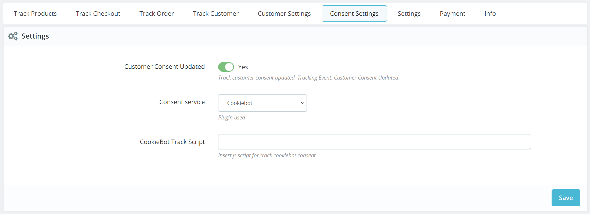

---
Prestashop to Segment Tracking by Xcommerce - Source
---

[Segment Tracking](https:xcommerce.eu/segment) provides self-serve predictive analytics for growth marketers, leveraging machine learning to automate audience insights and recommendations.

This is an [Event Cloud Source](/docs/sources/#event-cloud-sources) which can not only export data into your Segment warehouse, but can also federate the exported data into your other enabled Segment Destinations.

This source is maintained by Prestashop to Segment Tracking by Xcommerce. For any issues with the source, [contact their Support team](mailto:info@xcommerce.eu).

## Getting started

1. From your workspace's [Sources catalog page](https://app.segment.com/goto-my-workspace/sources/catalog){:target="_blank”} click ***Add Source***.
2. Search for "Prestashop (by Xcommerce)" in the Sources Catalog, select "Prestashop (by Xcommerce)", and click ***Add Source***.
3. On the next screen, give the Source a name configure any other settings.
   - The name is used as a label in the Segment app, and Segment creates a related schema name in your warehouse. The name can be anything, but we recommend using something that reflects the source itself and distinguishes amongst your environments (eg. SourceName_Prod, SourceName_Staging, SourceName_Dev).
4. Click ***Add Source*** to save your settings.
5. Copy the Write key from the Segment UI.
6. Log in to your Prestashop Admin Panel, go to "Prestashop (by Xcommerce)" Module Settings, and paste the API Key in the Settings tab (as described in the Configuration section) ***To check phrasing***

## Installation

1. Get the Xcommerce Segment Integration from Shopware Market. 
  After the purchase, you will get a .zip file
2. Go to Prestashop Admin Panel -> Improve -> Module Manager
3. Click "Upload a module" and select the .zip file for the upload

## Configuration

1. To configure the module go to Prestashop Admin Panel -> Improve -> Module Manager
2. Browse for the Segment Tracking module and select Configure option for the module

    

   > **Note**: On the configuration page you will see a number of Tabs corresponding to various settings. Start with the las tab (Settings)

3. Settings tab:

    
    This is the page where you will select the general connection and labeling options.
   - Active - Select if the Module is active and sends data to Segment
   - API Key - API key for the designated Segment Source
   - API Host - Only needed if the host is not in the US ***More details may be needed, but could not find any in the Segment documentation (https://segment.com/docs/connections/sources/catalog/libraries/website/javascript/custom-proxy/ https://segment.com/docs/connections/sources/catalog/libraries/server/http-api/)***
   - Storefront Action Label - Designate a label you want to be included in the events triggered by actions performed in Storefront
   - Backoffice Action Label - Designate a label you want to be included in the events triggered by actions performed in Backoffice
   - Event Category - Designate the default event category name. This will be visible in all Events
   - Page View - You can select if you want to track all the viewed pages. This will send an event o every page load.
   
    > **Note**: Make sure to click Save after you are satisfied with the configurations.
   
4. Consent Settings Tab:

    
    On this page you can select if and how to track Customer Consent Settings
   - Customer Consent Update - Select if the consent update will be tracked or not
   - Consent Service - Select one of two options: CookieBoot or Custom
   - Track Script - Enter the js script for the Consent Service
   
    > **Note**: Make sure to click Save after you are satisfied with the configurations.

5. Customer Settings tab:

    
    Here you will find two settings: "Customer traits included in:" and "Customer Id value"

   - Customer traits included in:
     - Identify - This option will trigger a separate identify event along with the Customer Login, Customer Register, Consent Updated and Customer Updated events. This Event will contain the Customer specific properties. 
     - Track context traits - No Identify event will be triggered. Instead, the Customer specific properties will be included in all the Events. The properties will pe present in the "context" array.
     - Track context properties - No Identify event will be triggered. Instead, the Customer specific properties will be included in all the Events. The properties will pe present in the "properties" array.
     
   - Customer ID value
     - Default user id - Use the Prestashop user ID as the Customer ID value
     - Custom user id - You can specify a certain field from the Database ***(id_customer needs to be mentioned in the used table if a different table than ps_customer is used)***
     - Email dash - Use the email hash of the customer as the Customer ID value. You can also add a Prefix and a Suffix to the email hash.
     - Do not use user id - Use an anonymous ID as the Customer ID value

    > **Note**: Make sure to click Save after you are satisfied with the configurations.
     
6. The rest of the tabs can be used to enable or disable the Events tracked by Segment Tracking. There are 4 tabs, one for each category of events: Track Products, Track Checkout, Track Order and Track Customer. Use these tabs to select which event you want Segment Tracking to track.

## Stream

Prestashop - Segment Tracking by Xcommerce uses our stream Source component to send Segment event data. It uses a server-side (select from `track`, `identify`, `page`, `group`) ***We need to clarify and mention which methods are used for Server Side*** method(s) to send data to Segment. These events are then available in any destination that accepts server-side events, and available in a schema in your data warehouse, so you can query using SQL.

The default behavior is for Klaviyo (***Klaviyo is a data analytics driven marketing platform https://www.klaviyo.com/about It seems that this is an informative note of how Klaviyo is expecting data***) to pass the userId associated with the email recipient as the userId. There are cases in which Klaviyo does not have an associated userId, in which case the email address will be passed in as the anonymousId.

## Events

The table below lists events that Prestashop - Segment Tracking by Xcommerce sends to Segment. These events appear as tables in your warehouse, and as regular events in other Destinations. Prestashop - Segment Tracking by Xcommerce includes the `userId` if available.
 
### Identify calls

For every event where there is an identifiable customer (from both the device-mode and cloud-mode) Xcommerce Segment Integration also sends an Identify call. This happens when the customer logs into the storefront, on the last step of the checkout, with the order, and also after purchase with any customer update in Admin Panel.

The following traits are included with an Identify call:

| Property Name              | Description                                                            | Property Type |
|----------------------------|------------------------------------------------------------------------|---------------|
| userId                     | The chosen user identifier. This defaults to the Shopify Customer ID.  | Double        |
| createdAt                  | The date the customer record was created.                              | Date          |
| customerLifetimeValue      | The total spend of the customer on the Shopify store.                  | Double        |
| default_address.street     | The customer's default street address.                                 | String        |
| default.address.postalCode | The customer's ZIP or postal code.                                     | String        |
| default_address.state      | The customer's state address.                                          | String        |

### Cloud-mode events (server side)

Cloud-mode handles events that have data stored or calculated in the Database. These events send data that is not necessarily available to the User in the browser. This method can capture information that would otherwise be inaccessible due to add block, for example.

| Event Name                    | Description                                                                                          | ***Triggers????*** |
|-------------------------------|------------------------------------------------------------------------------------------------------|--------------------|
| Customer Consent Update       | Follows updates to the User Consent                                                                  |                    |
| Customer Register             | Follows the submission of the Customer Register form                                                 |                    |
| Customer Created              | Follows the successful creation of a customer in Backoffice                                          |                    |
| Customer Login                | Follows the successful Customer Login events                                                         |                    |
| Customer Logout               | Follows the successful Customer Logout events                                                        |                    |
| Customer Updated              | Follows updates to a Customer Account                                                                |                    |
| Product Viewed                | Follows the successful loading of Product Detail Pages                                               |                    |
| Product Quick Viewed          | Follows the viewing of Product Quick View pop-up                                                     |                    |
| Product List Viewed           | Follows the displaying of Product Lists                                                              |                    |
| Product List Filtered         | Follows the applying of Filters on Product Lists                                                     |                    |
| Product Searched              | Follows the loading of Product Searches Results pages                                                |                    |
| Product Searched Autocomplete | Follows the population of Search Autocomplete lists                                                  |                    |
| Product Added                 | Follows the successful adding of products to cart                                                    |                    |
| Product Quantity Updated      | Follows the product quantity updated on Cart Page                                                    |                    |
| Product Removed               | Follows the removal of products from Cart page                                                       |                    |
| Cart Viewed                   | Follows the successful loading of the Cart Page                                                      |                    |
| Checkout Started              | Follows the successful loading of the first Checkout Step ***to be clarified***                      |                    |
| Checkout Step Viewed          | Follows the successful loading of subsequent Checkout Steps                                          |                    |
| Thank You Page Viewed         | Follows the successful loading of Thank You Pages after placing an order                             |                    |
| Order Completed               | Follows the successful placing of an Order (from Storefront or Backoffice)                           |                    |
| Order Cancelled               | Follows the successful changing of the Order Status to "Canceled" from Backoffice                    |                    |
| Order Refunded                | Follows the successful changing of the Order Status to "Refunded" from Backoffice                    |                    |
| Order Updated                 | Follows the successful update of the Order from Backoffice (status changes or order details changes) |                    |

## Event Properties

The table below list the properties included in the events listed above.

### Product Properties

| Property Name                      | Description                                                       | Property Type |
|------------------------------------|-------------------------------------------------------------------|---------------|
| `brand`                            | The brand of the product                                          | String        |
| `compare_at_price`                 | The product price before any discount                             | Number        |
| `category`                         | The category of the product                                       | String        |
| `currency`                         | Currency code associated with the transaction                     | String        |
| `image_url`                        | The URL of the first product image                                | String        |
| `name`                             | The product name                                                  | String        |
| `position`                         | The product position in the collection                            | Integer       |
| `presentment_amount`               | The product price as displayed to the user                        | Number        |
| `presentment_currency`             | The currency displayed to the user                                | String        |
| `prestashop_product_id`            | Prestashop Product ID                                             | String        |
| `prestashop_variant_id`            | Prestashop Product Variant ID                                     | String        |
| `price`                            | The product price at the time of the event, in the store currency | Number        |
| `product_id`                       | The Prestashop Product ID                                         | String        |
| `products`                         | Products displayed in the product list                            | Array         |
| `quantity`                         | The quantity of products                                          | Integer       |
| `sku`                              | The product SKU                                                   | String        |
| `tags`                             | The product tags                                                  | String        |
| `url`                              | The URL of the product page                                       | String        |
| `variant`                          | The product variant name                                          | String        |

### Order Properties
 
| Property Name                | Description                                                           | Property Type |
|------------------------------|-----------------------------------------------------------------------|---------------|
| `cart_id`                    | The ID of the Prestashop cart                                         | String        | 
| `coupon`                     | Coupon id and name associated with the product ***or transaction??*** | String        |
| `currency`                   | Currency code associated with the transaction                         | String        |
| `discount`                   | The discounted amount                                                 | Number        | 
| `lifetime_revenue_xcommerce` | User lifetime revenue                                                 | Number        |
| `event_category`             | The category of the events, as set in Backoffice                      | String        |       
| `order_id`                   | The ID of the order                                                   | String        |      
| `payment_gateway_xcommerce`  | The payment gateway used by the customer                              | String        |     
| `presentment_amount`         | The product price as displayed to the user                            | Number        |    
| `presentment_currency`       | The currency displayed to the user                                    | String        |   
| `purchase_count_xcommerce`   | Total purchase count for the customer                                 | Integer       |  
| `revenue`                    | Revenue ($) associated with the transaction                           | Number        |      
| `shipping`                   | The shipping cost                                                     | Number        |      
| `shipping_gateway_xcommerce` | The shipping method chosen for checkout                               | String        |     
| `source_name`                | The source of the order or checkout (e.g. web, android, pos)          | String        |    
| `source`                     | The reason of the trigger                                             | String        |   
| `step`                       | The checkout step number                                              | Integer       |  
| `subtotal`                   | Order total after discounts but before taxes and shipping             | Number        | 
| `tax`                        | The amount of tax on the order                                        | Number        |       
| `total`                      | Revenue with discounts and coupons added                              | Number        |      

### Customer Properties

| Property Name                      | Description                                                                                                                                                                          |
|------------------------------------|--------------------------------------------------------------------------------------------------------------------------------------------------------------------------------------|
| `birthday`                         | User birthday                                                                                                                                                                        |
| `created_at`                       | The date the account was created                                                                                                                                                     |
| `customer_lifetime_value`          | The total amount paid on orders by the customer                                                                                                                                      |
| `lifetime_revenue_xcommerce`       | ***This is mentioned in the documentation and used on order events, but not mentioned on Login event. It seems to be replaced by 'customer_lifetime_value', which one do we keep?*** |
| `first_name`                       | User name                                                                                                                                                                            |
| `gender`                           | The gender of the user                                                                                                                                                               |
| `last_name`                        | User last name                                                                                                                                                                       |
| `last_order_date`                  | The date of the las order made on the user account                                                                                                                                   |
| `purchase_count`                   | The date of the last order placed on the user account                                                                                                                                |
| `prestashop_customer_id_xcommerce` | Prestashops's identifier for the customer ***This has been removed, should we keep it?***                                                                                            |                                                                                                                                 |
| `userId`                           | Prestashop customer ID                                                                                                                                                               |

### Other

| Property Name                      | Description                                                       |
|------------------------------------|-------------------------------------------------------------------|
| `brand`                            | The brand of the product                                          |
| `cancel_reason`                    | The reason for canceling the order                                |
| `cart_id`                          | The ID of the Prestashop cart                                     |
| `category`                         | Event category (defaults to Prestashop(Xcommerce))                |
| `checkout_id`                      | The ID of the checkout session                                    |
| `compare_at_price`                 | The product price before any discount                             |
| `coupon`                           | Coupon code associated with the product                           |
| `coupon_id`                        | ID of the coupon                                                  |
| `currency`                         | Currency code associated with the transaction                     |
| `discount`                         | The discounted amount                                             |
| `email`                            | Prestashop email address, or email submitted on a storefront form |
| `fbc`                              | Facebook Campaign identifier                                      |
| `fbp`                              | Facebook Pixel identifier                                         |
| `image_url`                        | The URL of the first product image                                |
| `lifetime_revenue_xcommerce `      | User lifetime value                                               |
| `list_id`                          | Product list being viewed                                         |
| `name`                             | The product name                                                  |
| `order_id`                         | The ID of the order                                               |
| `payment_gateway_xcommerce`        | The payment gateway used by the customer                          |
| `payment_method`                   | The payment method chosen for checkout                            |
| `position`                         | The product position in the collection                            |
| `presentment_amount`               | The product price as displayed to the user                        |
| `presentment_currency`             | The currency displayed to the user                                |
| `presentment_total`                | Presentment total                                                 |
| `prestashop_customer_id_xcommerce` | Prestashops's identifier for the customer                         |
| `prestashop_product_id`            | Prestashop Product ID                                             |
| `prestashop_variant_id`            | Prestashop Product Variant ID                                     |
| `price`                            | The product price at the time of the event, in the store currency |
| `product_id`                       | The Prestashop Product ID                                         |
| `product_properties`               | Custom properties of purchased products                           |
| `products`                         | Products displayed in the product list                            |
| `products.$.brand`                 | The brand of the product                                          |
| `products.$.category`              | The category of the product (defaults to all)                     |
| `products.$.compare_at_price`      | The product price before any discount                             |
| `products.$.coupon`                | Coupon code associated with the product                           |
| `products.$.currency`              | The currency displayed to the user                                |
| `products.$.image_url`             | The URL of the first product image                                |
| `products.$.name`                  | The product name                                                  |
| `products.$.position`              | The product position in the collection                            |
| `products.$.presentment_amount`    | The product price as displayed to the user                        |
| `products.$.presentment_currency`  | The currency displayed to the user                                |
| `products.$.prestashop_product_id` | The Prestashop Product ID                                         |
| `products.$.prestashop_variant_id` | The Prestashop Product Variant ID                                 |
| `products.$.price`                 | The product price at the time of the event, in the store currency |
| `products.$.product_id`            | The Prestashop Product ID                                         |
| `products.$.quantity`              | The quantity of products                                          |
| `products.$.sku`                   | The product SKU                                                   |
| `products.$.tags`                  | The product tags                                                  |
| `products.$.url`                   | The URL of the product page                                       |
| `products.$.variant`               | The product variant name                                          |
| `purchase_count_xcommerce`         | Total purchase count for the customer                             |
| `quantity`                         | The quantity of products                                          |
| `query`                            | Query the user searched with                                      |
| `refund_reason`                    | The reason for the refund                                         |
| `results`                          | Number of products matching the search                            |
| `revenue`                          | Revenue ($) associated with the transaction                       |
| `sent_from`                        | Xcommerce source identifier                                       |
| `share_via`                        | Method of sharing                                                 |
| `shipping`                         | The shipping cost                                                 |
| `shipping_method`                  | The shipping method chosen for checkout                           |
| `sku`                              | The product SKU                                                   |
| `source_name`                      | The source of the order or checkout (e.g. web, android, pos)      |
| `step`                             | The checkout step number                                          |
| `subtotal`                         | Order total after discounts but before taxes and shipping         |
| `tags`                             | The product tags                                                  |
| `tax`                              | The amount of tax on the order                                    |
| `total`                            | Revenue with discounts and coupons added                          |
| `url`                              | The URL of the product page                                       |
| `url`                              | The URL for the current checkout step                             |
| `userConsent.analytics`            | User accepted or not analytics tracking                           |
| `userConsent.preferences`          | User has preferences for tracking                                 |
| `userConsent.sale_of_data`         | User has preferences for tracking                                 |
| `userId`                           | Prestashop customer ID                                            |
| `variant`                          | The product variant name                                          |
| `wishlist_id`                      | Prestashop wishlist ID                                            |

## Adding Destinations ***TO DO***

Now that your Source is set up, you can connect it with Destinations.

Log into your downstream tools and check to see that your events appear as expected, and that they contain all of the properties you expect. If your events and properties don’t appear, check the [Event Delivery](/docs/connections/event-delivery/) tool, and refer to the Destination docs for each tool for troubleshooting.

If there are any issues with how the events are arriving to Segment, [contact the Prestashop - Segment Tracking by Xcommerce support team](mailto:support@<integration_name>.com).

